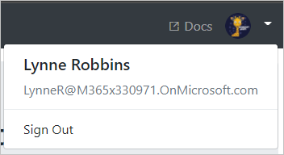

<!-- markdownlint-disable MD002 MD041 -->

En este ejercicio, ampliará la aplicación del ejercicio anterior para admitir la autenticación con Azure AD. Esto es necesario para obtener el token de acceso de OAuth necesario para llamar a Microsoft Graph. En este paso, integrará la biblioteca [de MSAL para Python](https://github.com/AzureAD/microsoft-authentication-library-for-python) en la aplicación.

1. Cree un nuevo archivo en la raíz del proyecto denominado `oauth_settings.yml` y agregue el contenido siguiente.

    :::code language="ini" source="../demo/graph_tutorial/oauth_settings.yml.example":::

1. Reemplace `YOUR_APP_ID_HERE` por el identificador de la aplicación del portal de registro de la aplicación y reemplace `YOUR_APP_SECRET_HERE` por la contraseña que ha generado.

> [!IMPORTANT]
> Si usa un control de código fuente como GIT, ahora sería un buen momento para excluir el archivo **oauth_settings. yml** del control de código fuente para evitar la pérdida inadvertida del identificador de la aplicación y la contraseña.

## <a name="implement-sign-in"></a>Implementar el inicio de sesión

1. Cree un nuevo archivo en el directorio **./tutorial** denominado `auth_helper.py` y agregue el siguiente código.

    :::code language="python" source="../demo/graph_tutorial/tutorial/auth_helper.py" id="FirstCodeSnippet":::

    Este archivo conservará todos los métodos relacionados con la autenticación. El `get_sign_in_flow` genera una dirección URL de autorización y el `get_token_from_code` método intercambia la respuesta de autorización para un token de acceso.

1. Agregue la siguiente `import` instrucción a la parte superior de **./tutorial/views.py**.

    ```python
    from tutorial.auth_helper import get_sign_in_flow, get_token_from_code
    ```

1. Agregue una vista de inicio de sesión en el archivo **./tutorial/views.py** .

    :::code language="python" source="../demo/graph_tutorial/tutorial/views.py" id="SignInViewSnippet":::

1. Agregue una vista de devolución de llamada en el archivo **./tutorial/views.py** .

    ```python
    def callback(request):
      # Make the token request
      result = get_token_from_code(request)
      # Temporary! Save the response in an error so it's displayed
      request.session['flash_error'] = { 'message': 'Token retrieved', 'debug': format(result) }
      return HttpResponseRedirect(reverse('home'))
    ```

    Tenga en cuenta lo que hacen estas vistas:

    - La `signin` acción genera la dirección URL de inicio de sesión de Azure ad, guarda el flujo generado por el cliente de OAuth y, a continuación, redirige el explorador a la página de inicio de sesión de Azure ad.

    - La `callback` acción es donde Azure redirige después de que se complete el inicio de sesión. Esa acción usa el flujo guardado y la cadena de consulta enviada por Azure para solicitar un token de acceso. A continuación, se redirige de nuevo a la Página principal con la respuesta en el valor de error temporal. Usará esto para comprobar que el inicio de sesión está funcionando antes de continuar.

1. Abra **./tutorial/URLs.py** y reemplace las `path` instrucciones existentes por `signin` lo siguiente.

    ```python
    path('signin', views.sign_in, name='signin'),
    ```

1. Agregue un nuevo `path` para la `callback` vista.

    ```python
    path('callback', views.callback, name='callback'),
    ```

1. Inicie el servidor y vaya a `https://localhost:8000` . Haga clic en el botón de inicio de sesión y se le redirigirá a `https://login.microsoftonline.com` . Inicie sesión con su cuenta de Microsoft y dé su consentimiento a los permisos solicitados. El explorador redirige a la aplicación, que muestra la respuesta, incluido el token de acceso.

### <a name="get-user-details"></a>Obtener detalles del usuario

1. Cree un nuevo archivo en el directorio **./tutorial** denominado `graph_helper.py` y agregue el siguiente código.

    :::code language="python" source="../demo/graph_tutorial/tutorial/graph_helper.py" id="FirstCodeSnippet":::

    El `get_user` método realiza una solicitud GET al punto de conexión de Microsoft Graph `/me` para obtener el perfil del usuario, mediante el token de acceso adquirido anteriormente.

1. Actualice el `callback` método en **./tutorial/views.py** para obtener el perfil del usuario de Microsoft Graph. Agregue la siguiente `import` instrucción a la parte superior del archivo.

    ```python
    from tutorial.graph_helper import *
    ```

1. Reemplace el `callback` método con el código siguiente.

    ```python
    def callback(request):
      # Make the token request
      result = get_token_from_code(request)

      #Get the user's profile
      user = get_user(result['access_token'])
      # Temporary! Save the response in an error so it's displayed
      request.session['flash_error'] = { 'message': 'Token retrieved', 'debug': 'User: {0}\nToken: {1}'.format(user, result) }
      return HttpResponseRedirect(reverse('home'))
    ```

    El nuevo código llama al `get_user` método para solicitar el perfil del usuario. Agrega el objeto de usuario a la salida temporal para las pruebas.

1. Agregue los siguientes métodos nuevos a **./tutorial/auth_helper. py**.

    :::code language="python" source="../demo/graph_tutorial/tutorial/auth_helper.py" id="SecondCodeSnippet":::

1. Actualice la `callback` función en **./tutorial/views.py** para almacenar el usuario en la sesión y volver a redirigir a la Página principal. Reemplace la `from tutorial.auth_helper import get_sign_in_url, get_token_from_code` línea por lo siguiente.

    ```python
    from tutorial.auth_helper import get_sign_in_url, get_token_from_code, store_user, remove_user_and_token, get_token
    ```

1. Reemplace el `callback` método por lo siguiente.

    :::code language="python" source="../demo/graph_tutorial/tutorial/views.py" id="CallbackViewSnippet":::

## <a name="implement-sign-out"></a>Implementación de cierre de sesión

1. Agregue una nueva `sign_out` vista en **./tutorial/views.py**.

    :::code language="python" source="../demo/graph_tutorial/tutorial/views.py" id="SignOutViewSnippet":::

1. Abra **./tutorial/URLs.py** y reemplace las `path` instrucciones existentes por `signout` lo siguiente.

    ```python
    path('signout', views.sign_out, name='signout'),
    ```

1. Reinicie el servidor y pase por el proceso de inicio de sesión. Deberás volver a la Página principal, pero la interfaz de usuario debe cambiar para indicar que has iniciado sesión.

    

1. Haga clic en el avatar de usuario en la esquina superior derecha para acceder al vínculo **Cerrar sesión** . Al hacer clic en **cerrar** sesión se restablece la sesión y se vuelve a la Página principal.

    

## <a name="refreshing-tokens"></a>Actualizar tokens

En este punto, la aplicación tiene un token de acceso, que se envía en el `Authorization` encabezado de las llamadas a la API. Este es el token que permite que la aplicación tenga acceso a Microsoft Graph en nombre del usuario.

Sin embargo, este token es de corta duración. El token expira una hora después de su emisión. Aquí es donde el token de actualización se vuelve útil. El token de actualización permite que la aplicación solicite un nuevo token de acceso sin que el usuario tenga que iniciar sesión de nuevo.

Como en este ejemplo se usa la MSAL, no es necesario escribir ningún código específico para actualizar el token. `acquire_token_silent`El método de MSAL controla la actualización del token si es necesario.
